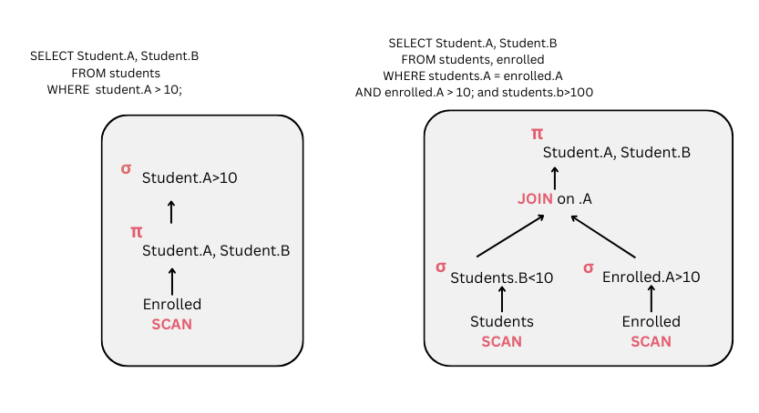

# Database Systems

This repository implements a **SQL interpreter from scratch in Java**, simulating core components of a relational database system. The interpreter processes a single SQL query using the `JSqlParser` over a file-based database by parsing, evaluating, and returning results according to relational algebra semantics. It supports the execution of SQL queries over raw table data (stored as plain text files) with no reliance on any external database engines. Further efforts were also done into `query optimization` (e.g. Selection Pushdown, Early Projections, Join Order Implementations) to increase efficiency and speed up computations. The interpreter is structured around the **iterator model**, a key abstraction in database systems, where each relational operator implements a uniform interface and can be composed into a query execution pipeline. This modular design enables efficient query evaluation through fast, tuple-at-a-time processing.

# Process Description
- Parsing SQL Query <br>
The SQL query is read and parsed using JSQLParser. <br>
- Building the Query Execution Plan<br>
**Scan Operator:** Reads the base table. <br>
**Projection Optimization:** If applicable, unnecessary columns are eliminated early.  <br>
**WHERE Clause Handling:** Filters are applied efficiently through selection pushdown for base table conditions. <br>
**JOIN Handling:** Joins are processed with extracted conditions. This is the most expensive operation. <br>
**GROUP BY and Aggregation:** Grouping and sum functions are processed. Important to note is that all cases have been handled. For example a sum can exist with and without a Group By and vice versa. <br>
**ORDER BY Processing:** Sorting is applied. This is always ascending. <br>
**Projection Finalization:** Ensures only necessary columns are included if early projection was not possible.<br>
**DISTINCT Handling:** Duplicate elimination if required. <br>
This step-by-step approach ensures an optimized and structured query execution. <br>


# Optimizations
## 1. Selection Pushdown Optimization <br>
The goal was to filter data as early as possible to avoid processing unnecessary rows in later operations. This was the most impactful optimization especially in more complex queries. Firstly, the `WHERE` clause is analyzed, and conditions are extracted using QueryOptimizer.extractConditions(whereExpression).  Conditions are categorized into:
- Single-table conditions: Applied immediately after scanning the relevant table using SelectOperator. A list of these conditions is maintained, and when a table is read, selection is activated using only the applicable conditions. If conditions apply only to a single table, they are merged using QueryOptimizer.mergeConditions(baseTableConditions) and applied before joins.
- Multi-table conditions: Deferred and applied during JoinOperator.

This significantly reduces the number of rows processed in joins and aggregation, eliminating unnecessary tuples early and improving overall performance and computation time. It is correct to do so, as the tuples not satisfying the conditions will not be returned by the query anyway, so its beneficial to discard them upfront.

Note: Importantly, trivial conditions involving LongValues (such as 1<2 or 2=1) are pushed to the BaseTable conditions (evaluated as in SingleTable) to ensure that they are applied as early as possible (Especially if the condition is False, this is very beneficial.)

## 2. Early Projection Optimization

The goal was to reduce data size early by selecting only necessary columns before processing joins and filters. While this can slightly improve computation time by speeding up joins and filtering, its primary benefit is reducing memory usage during query execution, as we would have less columns to process through the operators. Before executing the query, we check if early projection is feasible; otherwise, projection is applied at the end (before duplicate elimination). To simplify implementation, early projection is only done when: the SELECT statement does not include SELECT *; the query does not contain aggregate functions on columns, multiple columns from different tables are not used (otherwise, filtering would need to be deferred until scanning each table and have multiple `project` operators). The feasibility check occurs when collecting all columns required for GROUP BY, ORDER BY, and JOIN to see if SELECT contains all of them. If so, early projection is applied using a ProjectOperator immediately after scanning the base table (ScanOperator). It is correct do so, because those columns we will discard will not be used in the computation anyway.

## 3. Join Order Optimization Using Database Statistics
To optimize multi-table queries, join order is determined dynamically based on both correctness and estimated cost. The join order always starts with the base table (mandatory scan) from the FROM clause. Subsequent joins are chosen to form a valid chain — each new table must be connected to the already scanned tables via a join condition. This process resembles traversing a join graph. When multiple join options are available, we estimate their selectivity using precomputed statistics (min, max, distinct count, tuple count) stored in `DBStatistics`. For  joins, the selectivity is approximated as 1 / max(distinctCount(columnA), distinctCount(columnB)), as heurtistically we assume the equality join. The join with the highest selectivity (i.e., lowest expected output) is chosen to minimize intermediate result size. This reduces the cost of join processing, especially in queries with multiple tables, by avoiding large intermediate outputs and improving efficiency. This is valid because the join order does not matter. This minimizes intermediate result sizes and improves performance. The logic can be extended to support other condition types (e.g., range joins like A.x > B.y) by incorporating additional statistics such as value distributions or histograms, but since our data in this case were limited, this was not added. The DBstatistics class has the code to compute all these metrics. Also this can also be extended to compute the optimal order without having the contraint as using the FromItem as the base table, which could be more optimal


## 4. DBStatistics
For future use, the code to extract key information from a table has been written here. For every column in the table, the following statistics are computed: the min, max , distinct and total values. The plan was to optimize the order join by allowing the joins with highest selectivity to be chosen first, in order to minimize the output and speed the process. Again this is valid because the order of the joins does not matter.


<br>
Some of the optimizations being done (1 and 2) can be found here.




# File Organization
1. Within the `src/main` : <br>
`dbcatalogue`: contains dbcatalogue class <br>
`operator` : contains the base Operator class and the seven operators supported: `Select, Project, DuplicateElimination, Sum, Join, Scan, Sort` <br>
`query`: contains query optimizer, plan and interpreter <br>
`visitor`: contains expression visitor to evaluate conditions <br>

2. Within the `src/test`: <br>
Tests for each operator that I have implemented and used in the project (unit tests required by assignment), dbcatalogue and the tests for each query given in BlazeDBTest. The operators tests were done initially for bug debugging having as a child the scan operator.
Further testing was also done with a set of other queries to test the optimizations but also more complex and tricky queries. These queries can be found under `samples\extra_input`

2. Within `samples` <br>
All the given testing queries, the output and the expected output as well as the `extra_input` directory which contains a set of other 12 queries which were tested. These queries are more complex, for example they contain more AND conditions, more edge case scenarios. It was seen that for these queries the optimizations done in Task 2 reduced the processing time more significantly. 

<br>
If you want to test other queries you can use the following command

```bash
java -jar target/database_systems-1.0.0-jar-with-dependencies.jar \
samples/db samples/input/query1.sql samples/output/query1.csv

